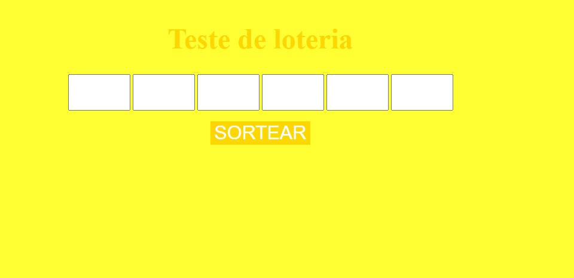
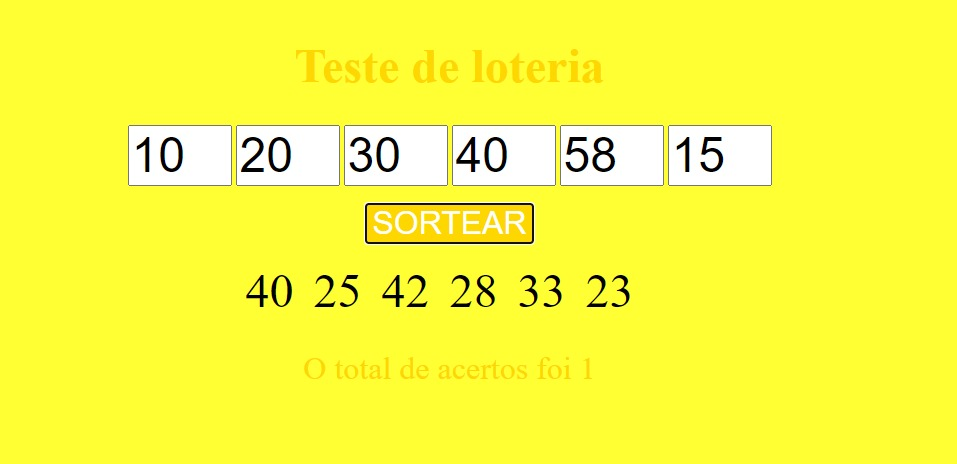

# Simulador de Loteria

Este projeto é um simulador da *mega-sena*, onde o usuário digita seis números. E sorteamos aleatoriamente outros seis números e comparamos para verificar quantos números você acertou.

**Não é para jogos oficiais**

## Tecnologias utilizadas
1. **HTML:** HTML (abreviação para a expressão inglesa HyperText Markup Language, que significa Linguagem de Marcação de Hipertexto) é uma linguagem de marcação utilizada na construção da estrutura das páginas na Web.
2. **CSS:**Cascading Style Sheets (CSS) é um mecanismo para adicionar estilo (cores, fontes, espaçamento, etc.) a um documento web.
3. **JS:** JavaScript (frequentemente abreviado como JS) é uma linguagem de programação interpretada estruturada, de script em alto nível com tipagem dinâmica fraca e multiparadigma (protótipos, orientado a objeto, imperativo e, funcional).
4. ~~**Jquery:**~~ não foi utilizado.

## Funções principais
Aqui será apresentado as duas funções principais do código do site

### Sorteio de números:
Nessa função os números são sorteados aleatoriamente.
```
function sortearNumeros() {
numSort = [];
let sort;
for (var i = 0; i < 6; i++) {
do {
sort = Math.ceil(Math.random() * 60);
sort = (sort == 0) ? 1 : sort;
}while(numSort.includes(sort));
numSort.push(sort);
}
}
```
### Lendo os números digitados:
Lê as entradas de números digitadas pelo usuário

```
function addToList(num, pos) {
if (num.length == 2) {
if (numEsco.includes(num)) {
alert2("Erro", "Numero Escolhido Anteriormente!! Digite outro numero!")
}else if(parseInt(num) > 60){
alert2("Erro", "O numero digitado não pode ser maior que 60");
 }else{
numEsco[pos -1] = num;
}
}
}
```

## Como Executar o Código
>  Abra o arquivo **_index.html_** no seu navegador.


## Imagens do código
**Tela 1:** Pagina inicial para digitar os números que serão sorteados.
 
 **Tela 2:** Números digitados e sorteados com 1 acerto.
 


## Exemplo em tabela
Número digitado  | Número Sorteado|
-----------------| ---------------
     2           |      43       |
     5           |      28       |    
     30          |      59       |   
     25          |      10       |  
     10          |      26       |
     11          |      56       |

#### referencias:
* HTML: [Wikipédia](https://pt.wikipedia.org/wiki/HTML)
* CSS: [Wikipédia](https://pt.wikipedia.org/wiki/Cascading_Style_Sheets)
* JS: [Wikipédia](https://pt.wikipedia.org/wiki/JavaScript)
